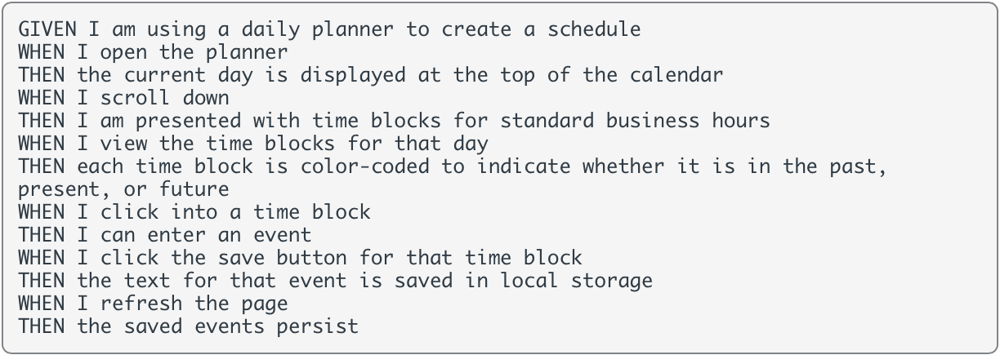
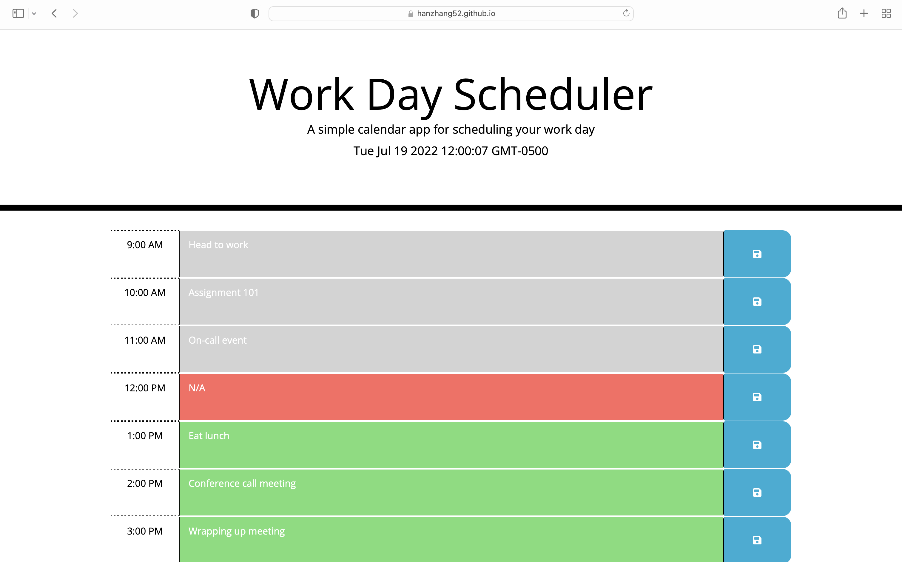

# Third-Party APIs: Work Day Scheduler

## Work-Day Scheduler

I have created a Work Day Scheduler using the material I've learned using additional Javascript concepts including jQuery and moment.js. My assignment was to create a planner where users can type and save their comments onto the planner timeline to make it fully functional. In addition, each time block presents a color section that represents the current, the past, and future time in the users’ local storage when it is saved while keeping in mind the following requirements:

## ScreenShot

The webpage was equipped with the layout and style, beneath shows what I've accomplished after adding the time block and adjusting to its own style.

## Link to deployed application:

https://hanzhang52.github.io/work-day-planner/

## License

MIT License

Copyright (c) [2022] [Han Zhang]

Permission is hereby granted, free of charge, to any person obtaining a copy
of this software and associated documentation files (the "Software"), to deal
in the Software without restriction, including without limitation the rights
to use, copy, modify, merge, publish, distribute, sublicense, and/or sell
copies of the Software, and to permit persons to whom the Software is
furnished to do so, subject to the following conditions:

The above copyright notice and this permission notice shall be included in all
copies or substantial portions of the Software.

THE SOFTWARE IS PROVIDED "AS IS", WITHOUT WARRANTY OF ANY KIND, EXPRESS OR
IMPLIED, INCLUDING BUT NOT LIMITED TO THE WARRANTIES OF MERCHANTABILITY,
FITNESS FOR A PARTICULAR PURPOSE AND NONINFRINGEMENT. IN NO EVENT SHALL THE
AUTHORS OR COPYRIGHT HOLDERS BE LIABLE FOR ANY CLAIM, DAMAGES OR OTHER
LIABILITY, WHETHER IN AN ACTION OF CONTRACT, TORT OR OTHERWISE, ARISING FROM,
OUT OF OR IN CONNECTION WITH THE SOFTWARE OR THE USE OR OTHER DEALINGS IN THE
SOFTWARE.
